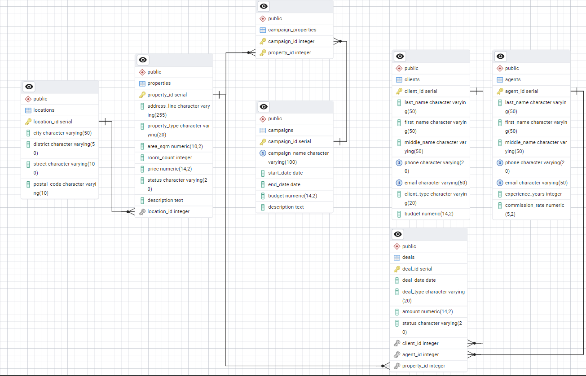

# UrbanSpace Realty – Database Management System

## 📌 Overview
**UrbanSpace Realty** is a relational database management system designed for a real estate agency. The system automates key business processes, including property management, client interactions, deal tracking, and marketing campaigns.

This project demonstrates a full cycle of database design: from conceptual modeling (ER diagrams) to physical implementation in **PostgreSQL**.

## 🚀 Key Features
* **Property Management:** Tracking apartments, houses, and offices with detailed characteristics.
* **Deal Processing:** Recording sales and rental transactions with automatic status updates.
* **Agent Performance:** Analyzing top-performing agents based on sales data.
* **Financial Reporting:** Calculating profits over specific periods.
* **Data Integrity:** Ensuring validity through constraints and triggers.

## 🛠 Tech Stack
* **Database:** PostgreSQL 14
* **Tools:** pgAdmin 4
* **Languages:** SQL, PL/pgSQL
* **Design:** 3NF Normalization, ER Modeling

## 📂 Database Structure
The database consists of the following core tables:
* `properties` – Real estate objects inventory.
* `clients` & `agents` – Personal data management.
* `deals` – Transaction history.
* `campaigns` – Marketing activities.
* `locations` – Address dictionary.

## ⚙️ Advanced SQL Implementation
This project goes beyond basic CRUD operations and implements server-side business logic:

### 🔹 Stored Procedures & Functions
* `get_top_agent()` – Identifies the agent with the highest number of closed deals.
* `calculate_period_profit(start, end)` – Calculates total income for a given timeframe.
* `find_properties(city, max_price)` – Filters available properties based on user criteria.
* `search_properties_by_keyword(keyword)` – Text search within property descriptions.

### 🔹 Triggers (Automation)
* **Status Automation:** `trg_update_property_status` automatically changes a property's status to "Sold" or "Rented" immediately after a deal is inserted.
* **Validation:** `trg_check_deal_date` prevents entering transactions with future dates.
* **Availability Check:** `trg_check_property_availability` ensures a property cannot be sold if it is already taken.
* **Budget Management:** `trg_deduct_client_budget` automatically updates the client's budget after a purchase.

### 🔹 Views (Reporting)
* `available_properties_view` – A user-friendly list of all currently available properties with full addresses.
* `agent_performance_view` – Real-time statistics on agent sales and deal counts.

## 📊 ER Diagram


## 🔧 How to Run
1.  Clone the repository:
    ```bash
    git clone [https://github.com/ivanKepchik/urban-space-realty-db.git](https://github.com/ivanKepchik/urban-space-realty-db.git)
    ```
2.  Open **pgAdmin 4** or any SQL client.
3.  Create a new database.
4.  Run the `database_schema.sql` script to create tables, functions, and triggers.

## 📄 Documentation
Detailed documentation (in Ukrainian), including the conceptual analysis and logical design, can be found in the [docs/](docs/) folder.
